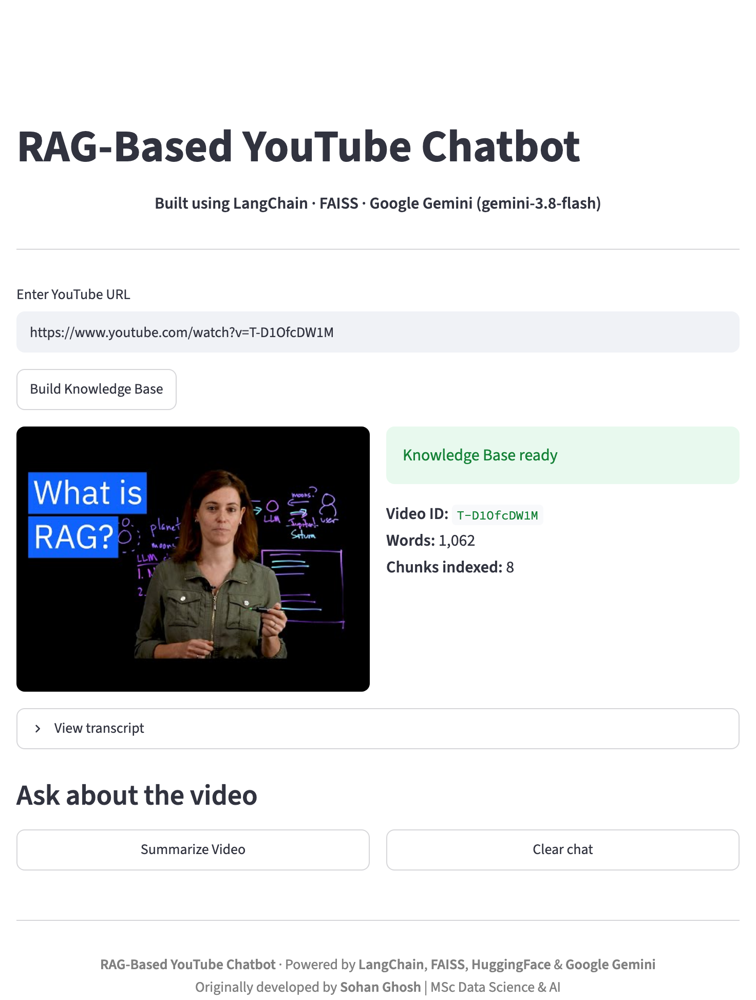
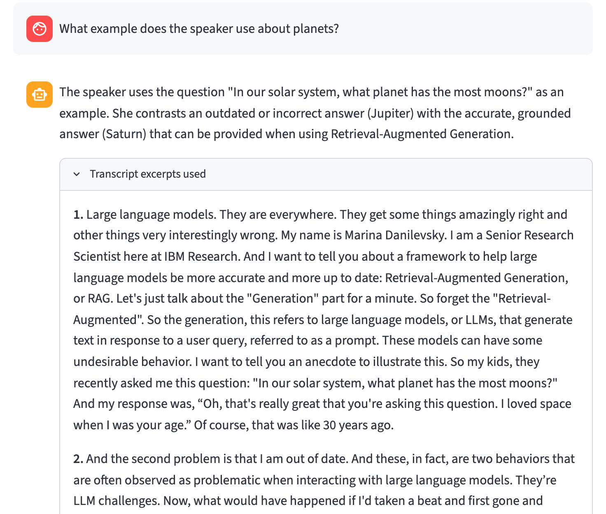
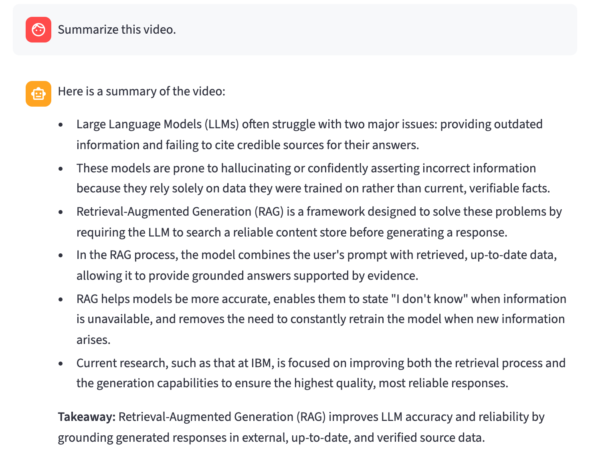

# RAG-Based YouTube Chatbot

Ask questions about any YouTube video, or get a summary of it, using Retrieval-Augmented Generation over the video's transcript.

**Built with:** LangChain · FAISS · HuggingFace embeddings · Google Gemini · Streamlit

Originally developed by Sohan Ghosh (MSc Data Science & AI). This version updates the project to current library versions, uses FAISS as the vector store, fixes the transcript loader, and adds chat memory, whole-video summaries and automatic Gemini model fallback. See `rag_chatbot.pdf` for the full project report.

## Demo

The walkthrough below uses IBM's *"What is Retrieval-Augmented Generation (RAG)?"* video.

### 1. Build a knowledge base from a YouTube URL

Paste a link and click **Build Knowledge Base**. The app fetches the transcript, splits it into chunks and indexes them in FAISS. It then shows the video, its word count and the number of chunks indexed (1,062 words → 8 chunks here).

<p align="center"></p>

### 2. Ask questions and see the sources

Answers come only from the retrieved transcript chunks. Expand **Transcript excerpts used** to see exactly which parts of the video the answer is based on.

<p align="center"></p>

### 3. Summarize the whole video

**Summarize Video** runs a map-reduce summary over the full transcript, not just the top-k chunks, and ends with a one-line takeaway.

<p align="center"></p>

## How it works

1. **Transcript** — fetched with `youtube-transcript-api` (manual captions preferred, then auto-generated; non-English captions are translated to English when possible). Falls back to `yt-dlp` captions if that fails.
2. **Chunking** — `RecursiveCharacterTextSplitter` (1000 chars, 200 overlap, split on sentence boundaries).
3. **Embeddings** — `sentence-transformers/all-MiniLM-L6-v2` (runs locally, ~90 MB, downloaded on first use).
4. **Vector store** — in-memory **FAISS** index; top-4 chunks retrieved per question.
5. **Generation** — **Google Gemini**, prompted to answer only from the retrieved excerpts. The last 3 question/answer pairs are included so follow-up questions ("explain that more") work.
6. **Summaries** — map-reduce over the *whole* transcript (not just the top-k chunks).
7. **Reliability** — if the main Gemini model is overloaded or unavailable, the app automatically retries with the fallback models.

## Project structure

```
rag_youtube_chatbot/
├── app.py                    # Streamlit chat UI
├── chain.py                  # Gemini setup, RAG Q&A, map-reduce summary
├── index.py                  # Chunking + embeddings + FAISS index
├── loader.py                 # Video ID parsing + transcript fetching (API + yt-dlp fallback)
├── requirements.txt          # Pinned dependencies (Python 3.11)
├── .env.example              # Settings template (copy to .env)
├── rag_chatbot.pdf           # Project report (this version)
└── assets/                   # Screenshots
```

## Run locally

**Prerequisites:** Python 3.11 and a free Gemini API key from https://aistudio.google.com/apikey

```bash
# 1. Create a virtual environment and install dependencies
python3.11 -m venv .venv
source .venv/bin/activate          # Windows: .venv\Scripts\activate
pip install -r requirements.txt

# 2. Add your API key
cp .env.example .env               # then paste your key after GOOGLE_API_KEY=

# 3. Run
streamlit run app.py
```

Open http://localhost:8501, paste a YouTube URL, click **Build Knowledge Base**, then chat or click **Summarize Video**.

## Settings (`.env`)

| Setting | Default | Meaning |
|---|---|---|
| `GOOGLE_API_KEY` | — | Your Gemini API key (required) |
| `LLM_MODEL` | `gemini-3.8-flash` | Main Gemini model (use the API model ID, not the display name) |
| `GEMINI_FALLBACK_MODELS` | `gemini-3.5-flash-lite,gemini-3.1-flash-lite` | Models tried in order when the main one is busy or unavailable |

Restart `streamlit` after editing `.env`.

## Notes & limitations

- Only works for videos that have captions (manual or auto-generated).
- YouTube sometimes blocks transcript requests from cloud/VPN IPs; running from a home network normally works.
- The knowledge base is in memory — it is rebuilt when you restart the app (cached per video while it runs).
- Retrieval quality is best for English; MiniLM is an English embedding model.
- Answer time depends on Gemini's load (about 9–50 seconds per answer in testing).

## Credits

LangChain · FAISS · HuggingFace Sentence Transformers · Google Gemini · Streamlit · youtube-transcript-api · yt-dlp
